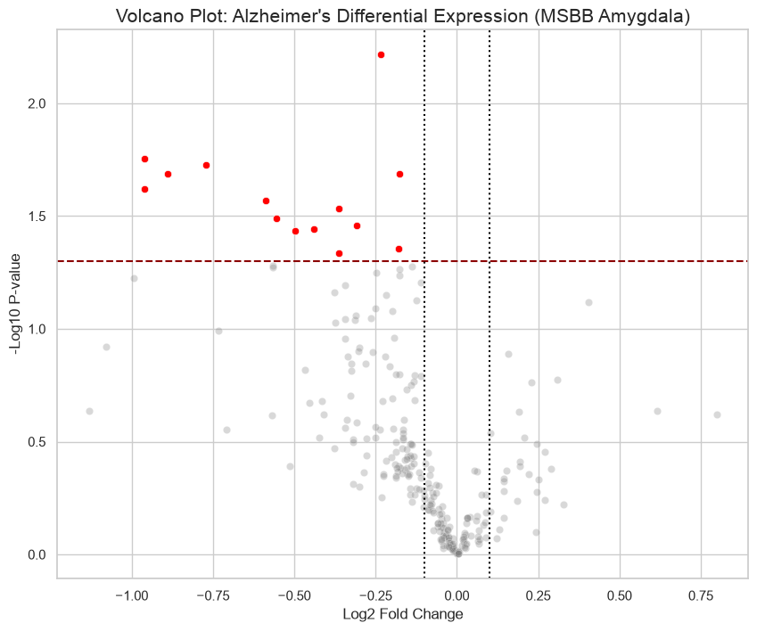

# Functional Genomics: RNASeq Analysis of Differentially Expressed Genes (MSBB Amygdala) 

### Project Overview 

When studying diseases, studying how they cause changes in gene expression is critical to understanding their pathology. This project aims to build upon sequencing data retrieved from the Mount Sinai Brain Bank (MSBB) via the Alzheimer DataLENS portal. The data is in the form of a count matrix consisting of Differentially Expressed Genes (DEGs) in the amygdala of Alzheimer's patients vs healthy patients.  

### The Biological Problem 

Which genes are differently expressed in patients with Alzheimer's? Furthermore, how do we ensure that the difference in expression is linked to the disease and not by random chance or noise from the sequencing machine? 

### Metric 1: P value

The P value determines the confidence with which we can determine if our data is significant or due to chance. I filtered out the DEGs with P value < 0.05 into a new sub dataframe in order to isolate them.A -log10 transformation of those P values was used in order to enhance later data visualization. 

### Metric 2: LogFC

Fold change is a measure of whether a gene is underexpressed (~0.5) or overexpressed (~2). Using a log2 transformation of that value is optimal for data visualization because it creates a symmetric scale. On a log2 scale, a twofold increase in expression becomes +1, while a twofold decrease becomes -1, placing up-regulated and down-regulated genes on an equal visual plane. 

### Technical Implementation

To ensure this repository is easy to follow, I organized it into 3 folders: 

1. functional_genomics/data: folder containing the csv file retrieved from MSBB. 

2. functional_genomics/notebooks:
   - I used  Jupyter notebook to document the process of filtering and analyzing the RNAseq data as well as storing the resulting subgraphs and volcano plot.
   - In this notebook I utilized pandas, numpy, matplotlib (plt), and seaborn to load and perform operations on the data frame and graph the results.
   - I generated a volcano plot to visualize the relationship between effect size (log2FC) and statistical significance. (-log10P_value)
   - The significant thresholds I applied were a double-filtering strategy (P_value < 0.05 and ∣logFC∣ >0.1) to identify high-confidence gene candidates.

3. functional_genomics/Alzheimers notes: As this is a self taught process, I documented all the information I gathered from reading about this disease and its pathology in terms of gene expression into this file.

### Key Results and Inference

The analysis revealed a prominent down-regulation bias in the Amygdala, which indicates a loss of transcriptional activity in these key pathways as Alzheimer's pathology progresses.

### How to run

Ensure all dependencies are installed using pip install pandas numpy matplotlib seaborn.

Open notebooks/Differential_Expression_Analysis.ipynb and run all cells to reproduce the resulting subgraphs and volcano plot.

